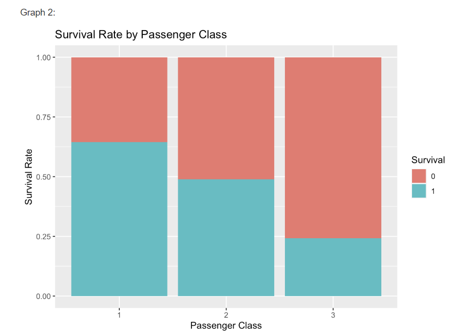
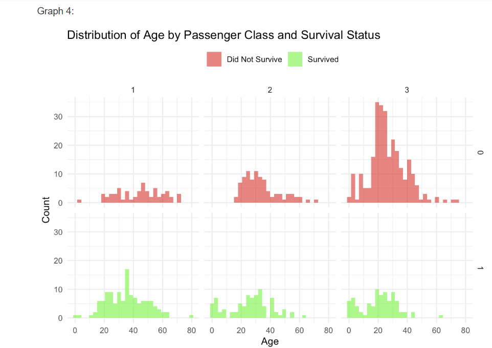

# Titanic
Personal Project
# Titanic Survival Analysis: Passenger Class, Gender, and Age Effects on Survival 🚢

## Overview

This project explores the survival rates of **Titanic passengers**, analyzing the impact of **passenger class, gender, fare, and age** on survival. Using statistical analysis and data visualizations, we uncover key patterns in survival probabilities.

## Features

- 📊 **Survival Rate Analysis**: Compares survival rates across **passenger class, gender, and fare ranges**.
- 🔍 **Age Distribution Study**: Analyzes **age-based survival trends** and average survivor ages.
- 🚀 **Data Visualizations**: Uses **ggplot2** in **R** to generate informative plots.
- 📁 **Reproducible Report**: Includes an **RMarkdown (`Titanic.Rmd`)** file for report generation.
- 📈 **Insights on Socioeconomic Factors**: Examines how **fare price and class** affected survival odds.

## Function Summary

### **Survival Rate Analysis**
- **`survival_by_class()`**  
  Computes and plots survival rate **by passenger class**.
- **`survival_by_fare()`**  
  Analyzes survival rates **across different fare ranges**.
- **`survival_by_gender()`**  
  Compares survival probabilities between **male and female passengers**.

### **Age & Survival Distribution**
- **`age_distribution_by_survival()`**  
  Visualizes the age distribution of survivors and non-survivors.
- **`mean_age_by_survival()`**  
  Computes **mean age of survivors and non-survivors** across different categories.

### **Data Processing**
- **`load_titanic_data()`**  
  Reads and cleans Titanic dataset, preparing it for analysis.
- **`generate_report()`**  
  Renders an HTML report from `Titanic.Rmd` with all insights and visualizations.

## Results 📊

### **Survival Rate by Passenger Class**

- **1st-class passengers had the highest survival rate**, followed by 2nd-class, while **3rd-class had the lowest.**
- **Women survived at significantly higher rates than men** across all classes.
- **Higher fares correlated with better survival chances.**

### **Age Distribution of Survivors vs. Non-Survivors**

- **Young children had a higher survival rate** than adults.
- Many **older passengers in 1st-class survived**, whereas older **3rd-class passengers had lower survival odds**.

## Future Work 🚀

- **Explore machine learning models** to predict Titanic survival probabilities.
- **Incorporate additional features** like family size and embarkation port.
- **Compare results with modern maritime disasters** for pattern insights.

---
